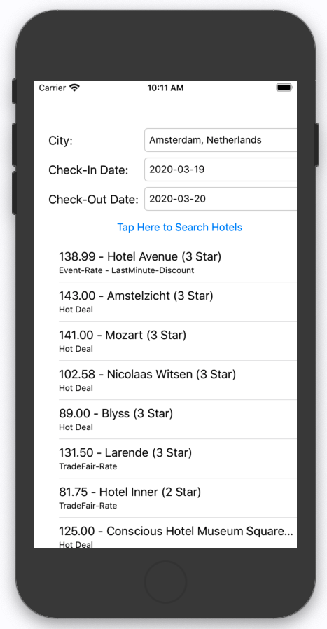

# Building an iOS application with Amadeus APIs

This repository contains the source code for the blog article [Building an iOS application with Amadeus APIs](https://developers.amadeus.com/blog/build-ios-app-with-amadeus-apis-swift-sdk).

## License

This library is released under the [MIT License](LICENSE).

## Help

Our [developer support team](https://developers.amadeus.com/support) is here to help you. You can find us on
[StackOverflow](https://stackoverflow.com/questions/tagged/amadeus) and
[email](mailto:developers@amadeus.com).

